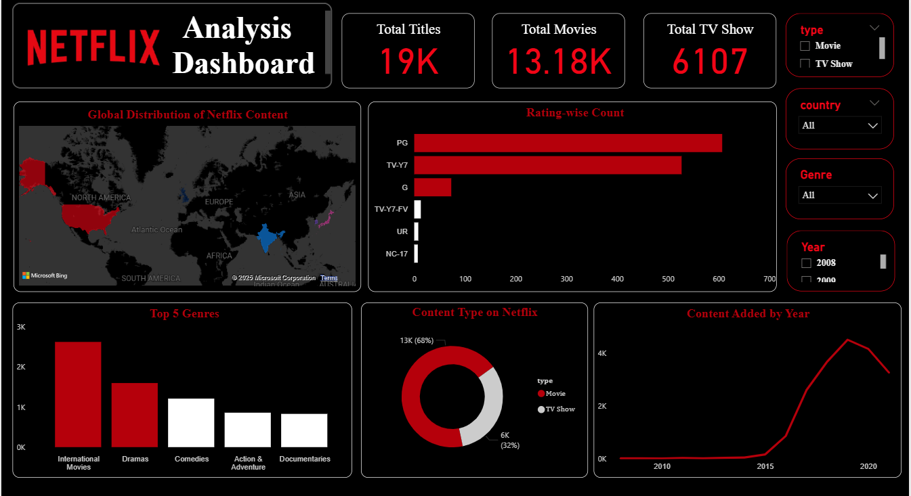

# Netflix Power BI Dashboard

This is an interactive dashboard created in Power BI to explore Netflix content by type, genre, country, and year.

## Tools Used:
- Power BI Desktop
- Data Cleaning using Power Query
- DAX Measures (basic)
- Visuals: Cards, Donut Chart, Bar Chart, Line Chart, Map

## Dashboard Preview:

## File:
- `Netflix_Dashboard.pbix` - Main Power BI file

## Features:
- Total Titles, Movies, TV Shows
- Global Map of Netflix Content
- Top 5 Genres
- Ratings Breakdown
- Content Added Over Time

